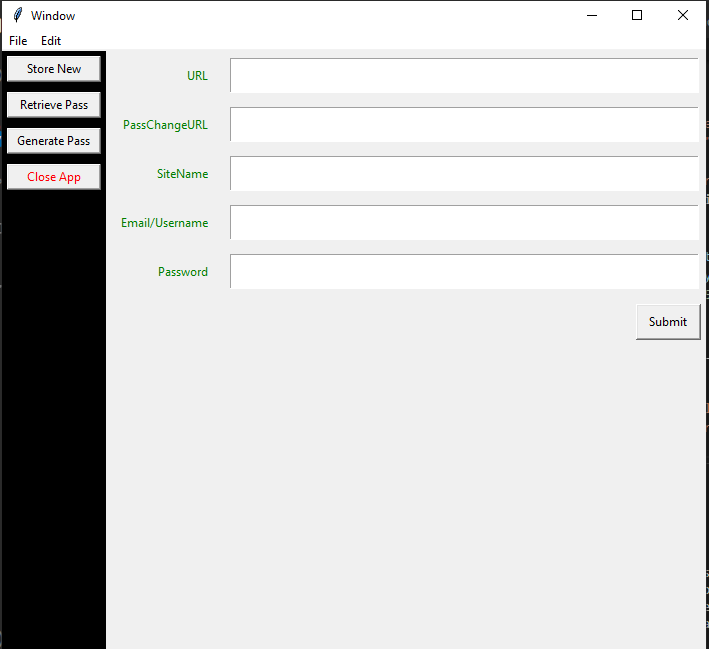

# PassHashStoreGUI

This program provides a platform for the hashing, storing and generating passwords

Usage
To use this application, follow these steps:
1. Clone this repo `git clone https://github.com/NerdPraise/PassHashStoreGUI.git`
2. Run `python app.py`
3. Follow the instruction prompt

